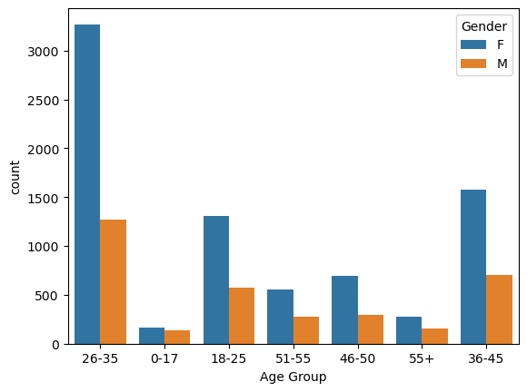
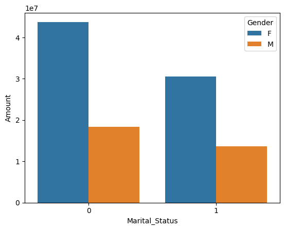

# Retail-Sales-Insights-Python
An Exploratory Data Analysis (EDA) project using Python to analyze Diwali sales trends. This project involves data cleaning and visualization to identify key customer demographics (age, gender, occupation) and high-performing product categories to improve business lead generation.

## 📌 Project Overview
This project performs a comprehensive Exploratory Data Analysis (EDA) on Diwali sales data to uncover key consumer purchasing patterns. By analyzing demographics such as gender, age, and occupation, this project provides actionable insights to help businesses optimize their marketing and inventory strategies for peak festive seasons.

## 🛠️ Data Cleaning & Preprocessing
To ensure the accuracy of our analysis, the following steps were taken to clean the dataset:
- **Handled Missing Values:** Identified and removed empty columns (`Status` and `unnamed1`) and dropped rows with null values in the `Amount` column.
- **Data Integrity:** Removed duplicate records to maintain unique transaction data.
- **Type Casting:** Converted the `Amount` data type from float to integer for consistent numerical calculations.
- **Initial Dataset Shape:** Started with `(11251, 15)` records and finalized with `(11239, 13)` after cleaning.

## 📊 Dataset Snapshot
| User_ID | Cust_name | Gender | Age Group | State | Occupation | Amount |
| :--- | :--- | :--- | :--- | :--- | :--- | :--- |
| 1002903 | Sanskriti | F | 26-35 | Maharashtra | Healthcare | 23,952 |
| 1000732 | Kartik | F | 26-35 | Andhra Pradesh | Govt | 23,934 |
| 1001990 | Bindu | F | 26-35 | Uttar Pradesh | Automobile | 23,924 |

## 🔍 Key Findings & Insights
Based on the visual analysis performed in the notebook, here are the primary takeaways:
- **Top Demographics:** Most buyers are **married women** within the **26-35 age group**.
- **Geographic Impact:** The highest sales volume originated from **Uttar Pradesh, Maharashtra, and Karnataka**.
- **Industry Insights:** Consumers working in **Healthcare, IT, and Aviation** sectors were the most frequent shoppers.
- **Product Performance:** The most popular product categories by both order count and revenue were **Food, Clothing, and Electronics**.

## 📊 Visualizations of Key Findings & Insights

<table>
  <tr>
    <td align="center"><b>Age Group & Gender Analysis</b> </td>
    <td align="center"><b>Marital Status vs Sales</b> </td>
    <td align="center"><b>Top 10 States</b> </td>
  </tr>
</table>

<table align="center">
  <tr>
    <td align="center"><b>Occupation & Gender</b> </td>
    <td align="center"><b>Top 10 Products</b> </td>
  </tr>
</table>

## 🚀 Conclusion
The analysis suggests that marketing campaigns targeting married women in high-tier states and specific corporate sectors (like Healthcare/IT) would yield the highest return on investment during the Diwali season.

## 🧰 Tech Stack
- **Language:** Python
- **Libraries:** Pandas, NumPy, Matplotlib, Seaborn
